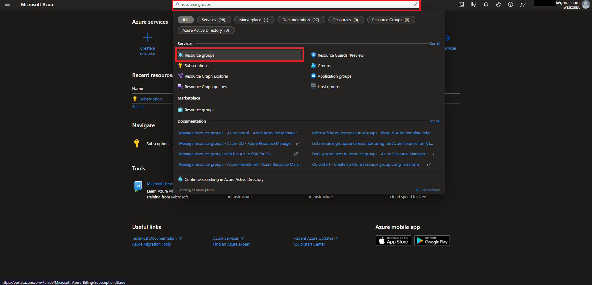
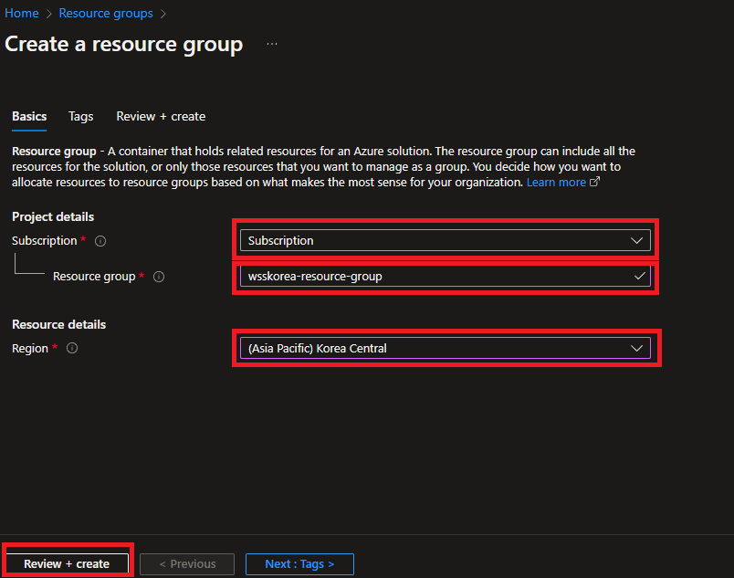
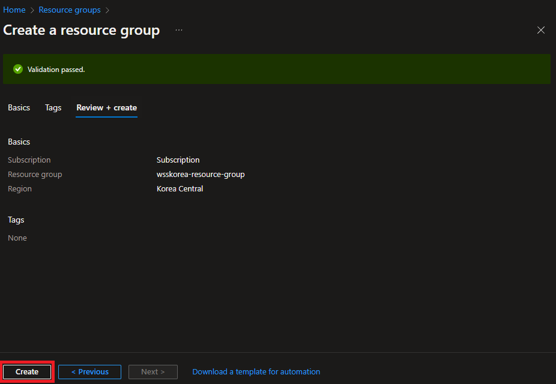
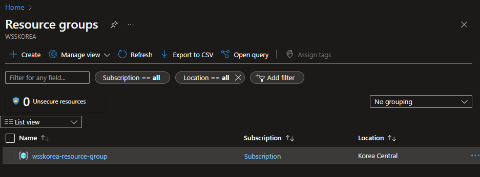
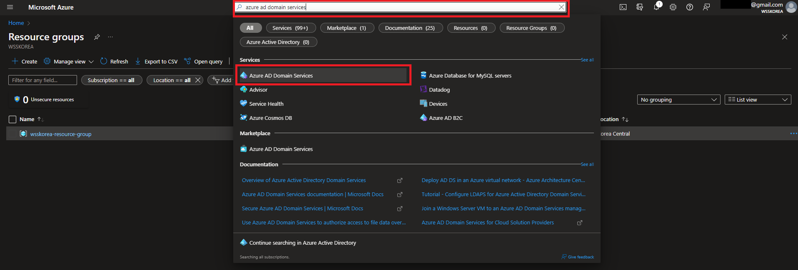
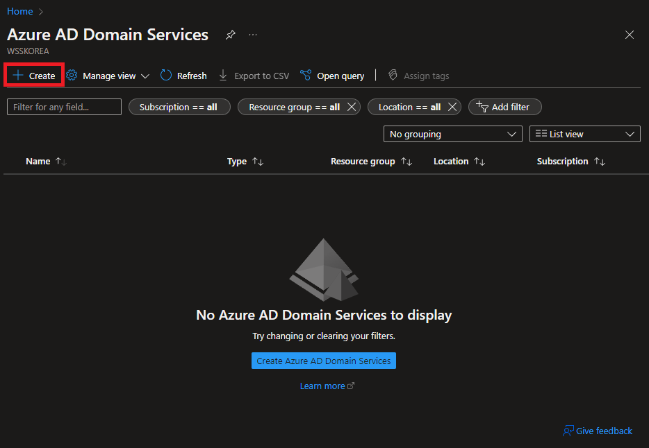
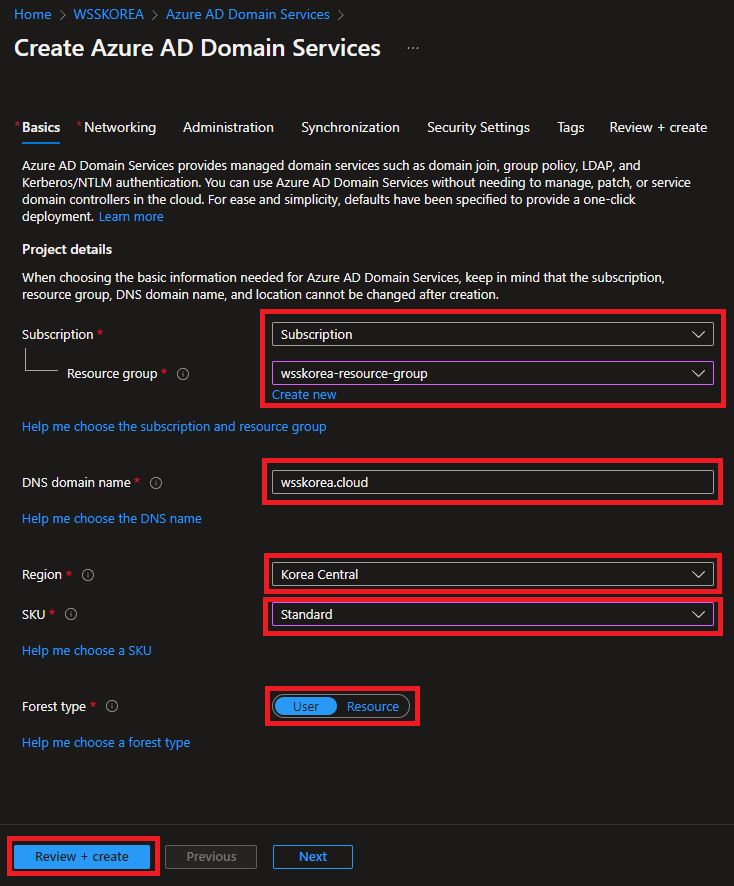
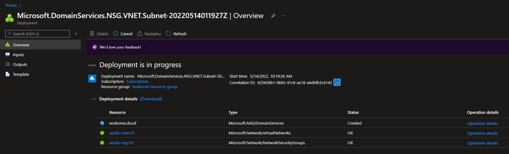
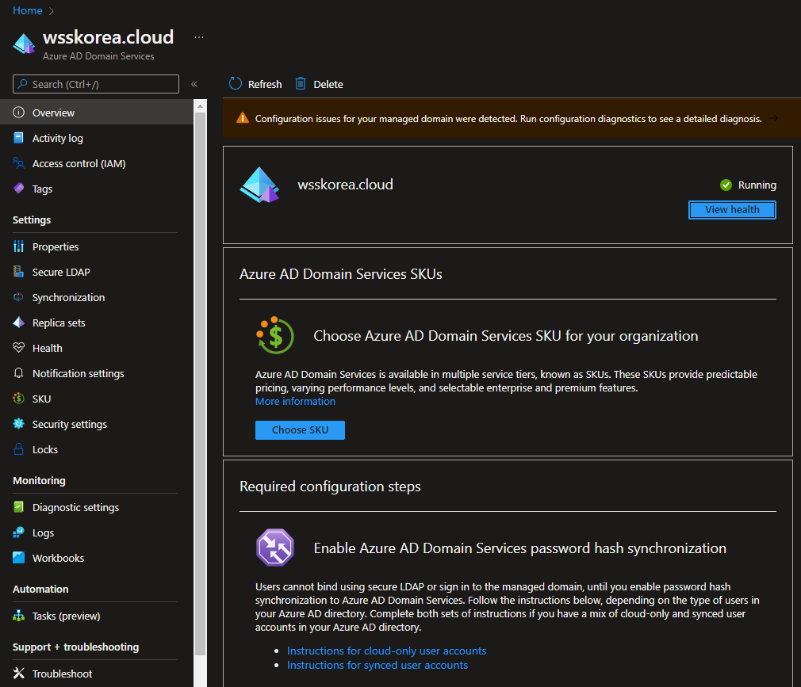

Azure AD 상에서 Domain Service(DS)를 사용할 수 있도록 DS 설정을 실습해보겠습니다.

# Resource Group 생성

DS를 설정하기 전에 앞서서 먼저 **Resource Group**을 생성해야 합니다.

Azure portal에 접속하신 후, `Resource groups` 서비스에 들어갑니다.

현재 아무 그룹도 생성되지 않은 상태입니다. 상단의 `Create`를 클릭합니다.

- `Subscription` : 결제 옵션 선택
- `Resource group` : 그룹 이름
- `Region` : 리소스 그룹 리전

각 정보를 적절하게 입력하신 후 하단의 `Review + create`를 클릭합니다.

(태그 지정이 필요하시다면 `Next: Tags`를 클릭해 태그 지정이 가능합니다.)

설정이 올바르다면 Validation이 통과됩니다. 바로 하단의 `Create`를 클릭해 생성을 완료합니다.

새로운 리소스 그룹 생성이 완료되었습니다.

# AD DS 생성

리소스 그룹 생성 후, 바로 AD DS를 생성해보겠습니다.

`Azure AD Domain Services`를 검색해 AD DS로 접속합니다.

상단의 `Create`를 클릭해 바로 생성을 시작합니다.

- `Subscription` : 결제 옵션 선택
- `Resource group` : 그룹 이름
- `DNS domain name` : 사용할 도메인
- `Region` : 리소스 그룹 리전
- `SKU` : AD 유형. 실습이니까 `Standard` 선택
- `Forest type` : 기본값인 `User` 선택

바로 하단의 `Review + create`를 클릭하고, 생성을 진행합니다.

배포가 시작됩니다. 생각보다 시간이 오래걸립니다. 여유를 갖고 기다려주세요. 한 한시간 정도 걸린 듯 합니다.

배포가 완료되면 **Running**이라는 문구를 볼 수 있습니다.

